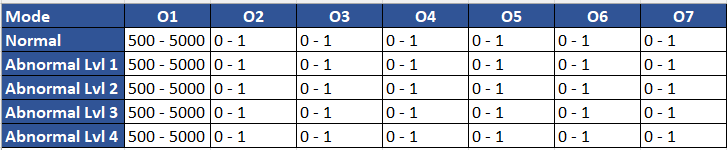
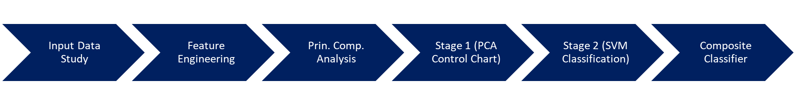
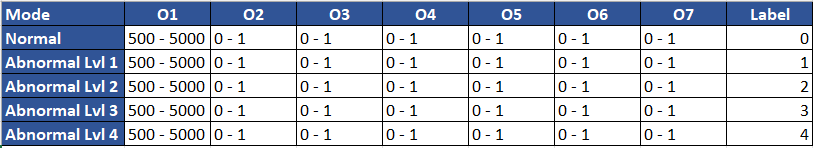
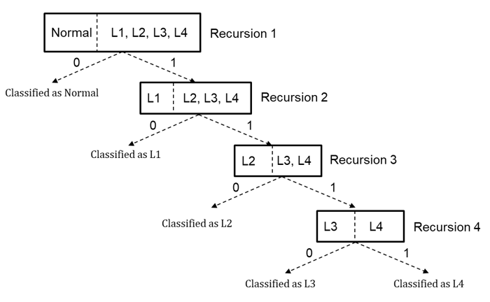
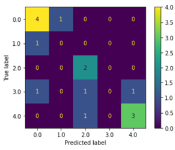

# Predictive-Maintenance-ML
Note: For the python code, reach out to me at https://www.linkedin.com/in/vishalkannan/  
Built a composite machine learning model to predict the working condition of an engine based on the multivariate performance indicators

## Index
1. Background
2. Overview
3. Input Data Study
4. Feature Engineering
- Logarithmic Scaling
- Outlier Removal
5. Principal Component Analysis
6. Stage 1
7. Stage 2
8. Composite Classifier

## Background

A leading NA automaker performed a series of experiments to
predict the performance of their engine under normal conditions
and abnormal conditions. The abnormality is set at four different
levels. The nature and levels of abnormality are protected by an 
NDA. The output measured is of a multivariate nature with specific number of
different outputs. The outputs measured are of multi-class nature and the output data is
protected by the NDA.

*Range of the multivariate output data (replaced by generic output parameters)*

## Overview

*A high level summary of the Machine Learning Model built*

## Input Data Study

O1 has a significantly higher range and variance compared to the other 6
outputs. A labelling criterion is built depending on the mode as shown below:

*Input data labelled*

## Feature Engineering

### Logarithmic Scaling

O1 is logarithmically scaled. The variance is significantly scaled down and the impact of outliers in the O1 field are reduced (both high and low).

### Outlier Removal

For sample groups with more than 7 samples (eg. Normal), the Mahalanobis distance is evaluated for each sample from the sample group mean. The chi-squared distribution is used to eliminate outliers based on the p value of 0.95. The restriction on sample group size (>7) is enforced to ensure that the covariance matrix is positive definite.

## Baseline

The baseline is a quick multinomial logistic regression model for the multi-class classification

## Multinomial Logistic Regression

A simple parameter grid is setup to determine the hyperparameters by analyzing the accuracy of the classifier. A 5-fold cross validation is used to calculate the average precision, recall and F1 scores for each class.

## Recursive SVM Classifier

Support Vector Machines are used for binary classification. The **hyperparameters** of the SVM classifier are fine tuned by converting the data into a normal vs abnormal binary classifier (labels > 1 are set to 1). A recursive Support Vector Machine algorithm is used to successively classify the testing samples into the appropriate label as shown below:

*Recursive SVM Classifier*

*Confusion Matrix Example*

The conditional probability is evaluated by performing **5-fold cross fold validation**
The precision, recall and F1 scores improve significantly for each class
